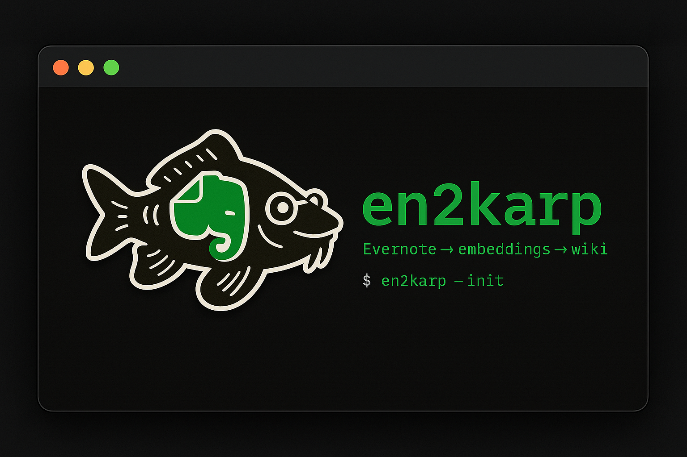

<p align="center"></p>

# en2karp-webapp-template

Static, installable (PWA) browser for the `catalog.json` + `metadata.json`
pair produced by the [`en2karp-catalog`](https://github.com/wordsmith189/en2karp-catalog)
skill. Zero build, zero backend — drop in the two JSON files, open
`index.html`, optionally add it to your iOS home screen.

## Quick start

```bash
# Option A — let the catalog skill scaffold it for you (recommended)
claude-code  # then: "scaffold the notes webapp at ~/repos/my-notes"

# Option B — clone manually
git clone https://github.com/wordsmith189/en2karp-webapp-template.git my-notes
cd my-notes
python3 -m http.server 8000
open http://localhost:8000
```

Then refresh data any time with:

```bash
python3 ~/repos/lars-claude-skills/en2karp-catalog/scripts/export_json.py --out ./
```

or ask Claude Code: *"export catalog to webapp"*.

## Install to iOS home screen

1. Serve the site over HTTPS (GitHub Pages works — the workflow in
   `.github/workflows/pages.yml` deploys on push) or use
   `http-server --ssl` locally.
2. Open in Safari on iOS.
3. Share → Add to Home Screen.
4. The service worker caches the shell + last-seen data so it works offline.

## Files

| File | Purpose |
|------|---------|
| `index.html` | Single-file UI. Search (debounced) + folder/status/tag/sort filters + expandable card list with "Load more" pagination. Lazy-loads note bodies on card open. |
| `manifest.json` | PWA manifest. |
| `sw.js` | Service worker — cache-first for shell, network-first for JSON, stale-while-revalidate for sidecars and image assets. |
| `vendor/marked.min.js` | Vendored markdown renderer (MIT). Used to render note bodies. |
| `catalog.json` | One object per live note. Replaced by `export_json.py`. |
| `metadata.json` | Folders, tags-with-counts, totals. Replaced by `export_json.py`. |
| `notes/<note_id>.json` | Per-note sidecar with `body_markdown` + image records. Written by `export_json.py`. |
| `assets/images/<sha1>.<ext>` | Content-addressed image copies referenced from note bodies. Written by `export_json.py`. |
| `icon-192.png`, `icon-512.png` | Placeholder app icons (192×192 / 512×512). Replace with your own art before publishing. |

## JSON schema

See `en2karp-catalog/scripts/_shared/catalog.py` (functions
`export_catalog_json`, `export_metadata_json`) and
`en2karp-catalog/scripts/_shared/assets.py` (`export_note_sidecars`)
for the authoritative schemas.

`catalog.json` is a flat list; each note has:
`note_id`, `title`, `folder`, `tags[]`, `created_date`, `modified_date`,
`word_count`, `source_url`, `file_path`, `image_count`, `has_ocr`, `wiki_status`.

`metadata.json`:
`generated_at`, `total_notes`, `folders[]`, `tags[{tag, count}]`.

`notes/<note_id>.json` (per-note sidecar, lazy-loaded on card open):
`note_id`, `title`, `file_path`, `body_markdown` (frontmatter stripped,
image refs rewritten to `assets/images/<sha1>.<ext>`), `images[]`
(each with `original_ref`, `asset_url`, plus optional `width`, `height`,
`ocr_text` when OCR data exists), `source_url`, `tags[]`, `modified_date`.

## Deep-link to a note

Appending `#note=<note_id>` to the URL opens that card and scrolls it
into view. Filters are cleared when following a hash so the target is
always reachable.

## Customizing

The UI is intentionally minimal (one HTML file, no framework). Edit the
inline `<style>` for colors, the render functions for layout. Keep the
service worker `CACHE_VERSION` bumped whenever you change `index.html` or
`manifest.json`, otherwise cached shells will stick around.

## License

MIT.
